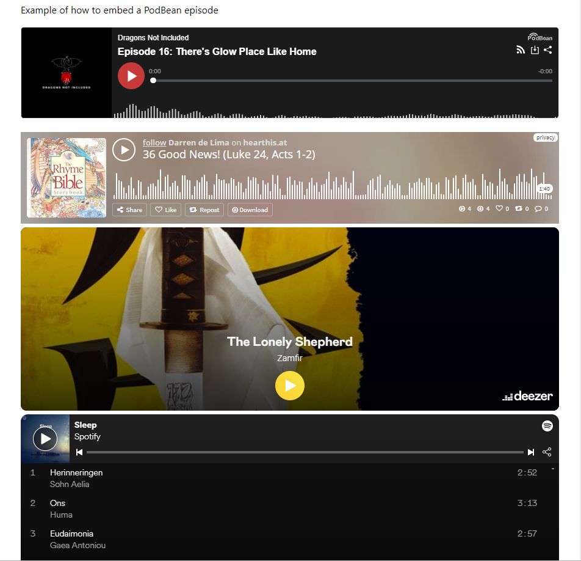

# Darth's Hugo shortcodes
A collection of Hugo shortcodes that you can use in any theme.

Hugo comes with shortcodes for YouTube, Vimeo, Twitter,  Instagram, GitHub Gist, and a few internal functions (detailed images, relative URLs). They are used for repeatable content or rendering content from SaaS sites. They are formatted as `` and will make anything from a GitHub Gist to a YouTube video appear embedded in your page.

This project aims to add a bunch more for popular services (initially focusing on podcasts/music) via `iframe` widget embeds, so that Hugo theme developers don't need to reinvent the wheel for every theme.

**I strongly recommend against over-reliance on shortcodes for embedding externally-hosted content, as they will be prone to [link rot](https://en.wikipedia.org/wiki/Link_rot).** If possible, prefer an image with a hyperlink, e.g. video thumbnail + hyperlink to video, or screenshot of Twitter post + hyperlink. Thus, once the target disappears, future readers will still have some idea what the linked content was. 

The folder structure should be self-explanatory, and you can add these directly to Hugo sites or themes. If you add them to your theme, please link back to this repo in visible credits.

## Release threads
**[GoHugo Discourse](https://discourse.gohugo.io/t/release-darths-hugo-shortcodes/38943)  |  [Reddit](https://www.reddit.com/r/gohugo/comments/v63kyu/release_a_collection_of_misc_3rd_party_shortcodes/)**

## Screenshot

## Included shortcodes
- [PodBean](https://www.podbean.com/)
- [HearThis.at](https://hearthis.at/)
- [Deezer](https://www.deezer.com/br/)
- [Spotify](https://open.spotify.com/)
- [Imgur](https://help.imgur.com/hc/en-us/articles/211273743-Embed-Unit)
- iCalendar embed (based off [GRA0007/modern-cal-embed](https://github.com/GRA0007/modern-cal-embed)) (local)
- [Google Maps](https://support.google.com/mymaps/answer/3024454) in a [privacy-friendly way](https://discourse.gohugo.io/t/embedding-google-maps-in-a-privacy-friendly-way/41575) (local)

## Usage

### Recommended
1. Download and extract ZIP (**offline**) or git clone submodule (**online**) into `\yourHugoWebsite\themes\`
2. Edit your site's `config.toml` so that its `[params]` are `theme = ["mainTheme", "darths-hugo-shortcodes"]`
	- Yes, you need to use another main theme alongside this. These shortcodes are just to add capabilities to other themes.
3. Copy the contents of `\exampleSite\` to your site's root, and see the examples (you can also read the shortcodes' HTML to for additional details). Use it alongside your main theme!
4. Call the shortcodes when desired in your site's content via `` or ``

### Manually
Copy the contents of `\layouts\shortcodes\` into the equivalent folder in your website root or theme root.

## TODO
See the [Roadmap](/ROADMAP.md) for a long list of planned integrations! This project aims to make Hugo as flexible as Wordpress and other social media.

## Further Reading
- See also official [Hugo documentation](https://gohugobrasil.netlify.app/templates/shortcode-templates/)
- ... and their [recommended examples](https://github.com/spf13/spf13.com/tree/master/layouts/shortcodes)
- See also official [Hugo documentation](https://gohugobrasil.netlify.app/templates/shortcode-templates/) (and also on the [official English site](https://gohugo.io/templates/shortcode-templates/))
- ... and their [recommended examples from spf13.com](https://github.com/spf13/spf13.com/tree/master/layouts/shortcodes)
- [The shortcodes directory for the Hugo docs](https://github.com/gohugoio/hugo/tree/master/docs/layouts/shortcodes)
- Hugo also ships with built-in shortcodes for common use cases. (See [Content Management: Shortcodes](https://gohugo.io/content-management/shortcodes/).)
- [Hugo relative link shortcodes](https://gohugo.io/content-management/cross-references/)
- Look in `/layouts/shortcodes` in your favourite or most-feature-heavy themes, there are good shortcodes there, too, but it is inefficient to implement shortcodes for 1 theme only
